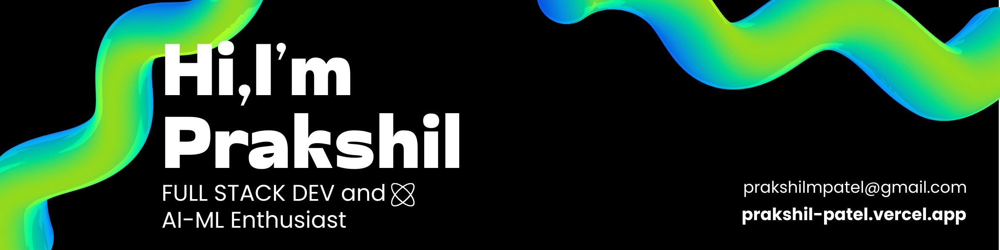

  

# 💫 About Me:
I’m Prakshil Patel, an aspiring AI/ML Engineer and Full-Stack Developer, currently pursuing a B.Tech in Information & Communication Technology (ICT) at Adani University. I enjoy building intelligent, scalable applications that blend clean UI with strong backend systems. My interests lie in AI-powered products, modern web development, and automation, where I turn ideas into practical, real-world solutions.
 
 
I’m actively open to freelance work, collaborations, internships, and full-time opportunities. I enjoy working with passionate teams, contributing to open-source, and solving challenging problems using technologies like React, Next.js, Python, FastAPI, and machine learning models. Always curious, always building. 🚀

## 🌐 Socials:
  

# 💻 Tech Stack:
                                                               
# 📊 GitHub Stats:
 
 

## 🏆 GitHub Trophies

### 🔝 Top Contributed Repo

<!-- Proudly created with GPRM ( https://gprm.itsvg.in ) -->
